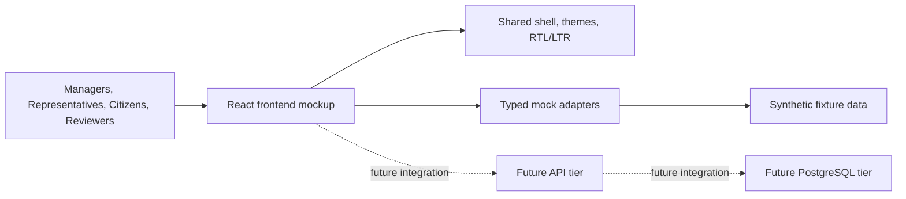

# Jutoverse Demo

`jutoverse_demo` is a frontend-first live mockup for AI-driven government-service optimization use cases derived from RFIs `7197`, `7190`, `7192`, and `7632`.

The current implementation is a polished `React + TypeScript + Vite` application with:

- six navigable feature areas
- Hebrew RTL and English LTR support
- typed mock adapters instead of a backend
- token-driven theming and GCP-oriented visuals adapted from `/Users/omid/projects/react-poc`
- resizable, collapsible, and expandable workspace panels

## Current Runtime Shape



## Feature Areas
Completed Feature Areas. The platform consists of six fully navigable feature areas designed to demonstrate AI orchestration alongside strict human oversight across multiple government service vectors.

1. Overview Page:
Severity-based filtering (Critical, Warning, Info, All) with expandable alert panels providing suggested actions and mandatory human review indicators.Workstream Navigation: Interactive, fully routed entry points directing operators to all operational subsections.Live Dashboard Simulation: To bypass static mock constraints, alert ages, data charts, and core telemetry metrics fluctuate dynamically every few seconds to replicate live traffic.Temporal Scaling: Fast toggling across Last Hour (1H), Last 24 Hours (24H), and Last 7 Days (7D) with contextual metric data recalculation.Cloud Capability Cards: Expandable structural maps identifying foundational architecture paths, edge use-cases, and execution payloads.Platform Telemetry Engine: Health monitoring blocks mapping real-time processing statuses for Web Layers, Mock APIs, AI Microservices, and Database Pools under human-in-the-loop validation.Workspace Optimization: Flexible application panels with complete user agency to expand, collapse, and resize independent window blocks.

 2. Service Operations Page:
 Real-time summary analytics visualizing active services, total open incidents, and global system availability statistics.Service Operations Queue: A deeply indexed register of monitored municipal services featuring inline query searches and instantaneous dataset retrieval.Action Command Center: Direct workflow links to mock-trigger service restarts, technical escalations, scheduled maintenance cycles, and instant status updates.AI Diagnostics & Activity Feeds: Predictive risk models analyzing system behaviors side-by-side with continuous log feeds evaluating document processing pipeline health, fraud alerts, and incident patterns.AI Operations Assistant: An on-page context-aware chatbot offering natural-language operational summaries and rapid incident resolution scripts.

3. Representative Assistant Page:
A comprehensive window pairing service agents with incoming citizen workflows utilizing continuous AI guidance, reference systems, and dynamic translation matrices.Knowledge Base Chat & Sources: Native interface allowing reps to query official government policies with verified document mapping displaying references, citations, and specific source backing.Multilingual Translation Panel: Intercepts input streams in Arabic, Russian, or Amharic, rendering live, translated output feeds across both English and Hebrew.Voice Transcription Core: An active microphone capture workflow simulating audio packet routing to translation middleware, delivering real-time Hebrew transcripts inline.Live Sentiment & Channels: Live telemetry meters translating consumer sentiment, platform channel inputs (Voice, Social, Chat), and supervisor alerts.

4. Citizen Services Page:
A unified case registry enabling filters across Case IDs, request genres, and processing states, instantly refreshing the workspace panel upon item selection.Dynamic Intake Modals: On-the-fly case instantiation with automatic unique token UUID generation, milestone routing, and priority assignment blocks.AI-Enhanced Extraction & Assessment: Structural OCR parsing showing extraction of citizen identification data, cross-checked against interactive predictive models detailing transaction risk profiles.Verification Tracking: Multi-stage workflow monitoring verification vectors like photo matching, signature checks, and legal address verification.

5. Research Review Page:
Connects the React UI to a Node.js/Express/Prisma stack tracking research proposals across strict linear logic gates: Submitted $\rightarrow$ Eligible $\rightarrow$ AI Review $\rightarrow$ Committee Decision $\rightarrow$ Notified.Automated AI Scoring Matrix: Connects to backend endpoints evaluating proposals across structural indices including significance, feasibility, methodology, and budget alignment.Ranked Shortlist Engine: Live sorting mechanics prioritizing incoming vectors based on overall algorithmic calculation alongside an executive stats bar for summary monitoring.Governance Fallback Mechanisms: Restricts funding actions (Fund, Waitlist, Decline) until AI scoring pipelines settle, keeping human decisions strictly at the helm. Fully supports bulk execution pipelines via "Notify All" handlers.

6. Administration Page:
 Global visibility into connected infrastructure pipelines. Includes error-handling simulations that toggle failures/recoveries without breaking underlying datasets.Governance Audit Ledger: Deep diagnostic streams filtering compliance data, runtime overrides, and administrative actions via an interactive keyword inspector.Theme & Access Configuration: Native token-driven theme switchers verifying accessibility conformity and structural UI presentation shifts across multi-tenant deployments.

## Local Development

```bash
npm install
npm run dev
```

Local deploy/debug helpers:

```bash
npm run deploy:local
npm run debug:local
```

The deploy helper starts a built preview on `127.0.0.1:4173` by default. The debug helper starts the Vite dev server on the same localhost address with hot reload.

You can override host and port:

```bash
npm run deploy:local -- --port 4174 --open
npm run debug:local -- --host 0.0.0.0 --port 3000
```

Validation commands:

```bash
npm run lint
npm run build
```

## Key Docs

- [docs/prd.md](docs/prd.md)
- [docs/ux-ui-style-contract.md](docs/ux-ui-style-contract.md)
- [docs/react-ux-implementation-plan.md](docs/react-ux-implementation-plan.md)
- [docs/frontend-only-implementation-plan.md](docs/frontend-only-implementation-plan.md)
- [docs/frontend-execution-assumptions.md](docs/frontend-execution-assumptions.md)
- [docs/agent-instructions.md](docs/agent-instructions.md)

## Notes

- The app is intentionally frontend-only today.
- Shared cloud deployment ownership remains outside this repo for GKE/platform and IaC concerns.
- The future `web -> api -> postgres` contract is preserved in the docs and in the mock adapter boundaries.
